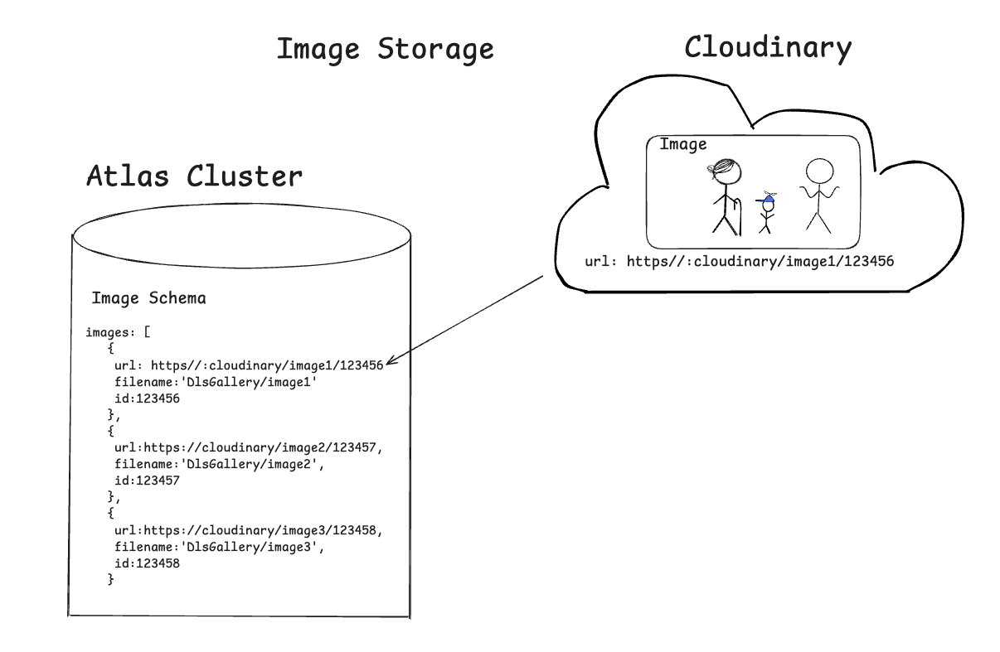

### [DLS Gallery](https://dls-gallery-q5o67.ondigitalocean.app/)
#### DLS gallery is my personal website where I display some of my favourite shots ive taken over the past few months.<br> It features user authentication and authorization via passport for any admin to have access to the deletion or uploading of new images.<br>It is designed to be have its images dynamically layed out so any admin does not have to worry about fixing any layout issues once an image is added or deleted, as it does so by itself.
### Table of Contents
- [Tools](#built-with)
- [Overview of Project](#how-does-dls-gallery-work)
- [Getting Started Guide](#getting-started)

### Built with:
- MongoDB Atlas Cluster
- Express
- Cloudinary
- Bootstrap
- Node
- Passport.js
### How does DLS-Gallery work???

### Getting Started
<details>
<summary>Setup Instructions</summary>
_DLS Gallery uses free tiers of both MongoDB Atlas and Cloudinary to store images.
To get your own DLS Gallery Started youll need to setup free accounts for both._

#### 1. Clone the repo
In your chosen directory, open the terminal and run:

    git clone git@github.com:Denilson0720/DLS-Gallery.git
then cd into the project if youre not already inside:
    cd DLS-Gallery
#### 2. Install Dependencies
Make sure youre in /DLS-Gallery. In your terminal check if so by running:

    ls
You should get a view such as:

    README.md               cloudinary              middleware.js           node_modules            package.json            utils
    app.js                  layouts                 models                  package-lock.json       public                  views
If so, go ahead and install dependencies: 

    npm i

#### 3. Create your own .env file where youll be adding your mongo atlas url and cloudinary url, run:
    touch .env
#### 4. Start setup of your Database. Log in to MongoDB Atlas
    
- Go to: https://www.mongodb.com/cloud/atlas

_If you don’t have an account, create one — it’s free🙌🏼_
#### 5. Create a Cluster
- In your dashboard, create new project, name it what youd like.(eg:DLS Gallery Demo)
    
- Click "Build a Cluster"

- Name it 'DLS-Gallery'
- Choose AWS as the provider
- Choose the Shared Cluster (free tier)

- Pick the region closest to you

- Click "Create Deployment"

- Wait a minute or two while it sets up.
#### 6. Create a Database User
- On the leftside panel go to Database > Security > Database Access 

- Click “Add New Database User”

- Username: dls_user

- Password: create a secure password (e.g. dls_test123, for dev only)

- Add an optional user description if youd like.(eg: dls demo user)

- Database User Privileges > Built-in Role: keep as Read and write to any database

- Click Add User
#### 7. Allow Access From Your IP
- Go to Network Access

- Atlas should have automatically added your IP address and should be listed below(eg:100.35.123.123), if so you can go ahead and skip this step. If not please continue...

- Click “Add IP Address”

- Choose “Allow Access from Anywhere” (0.0.0.0/0) for dev/demo use
(⚠️ Not safe for production)
#### 8. Get your Connection String
- Go to Database > Clusters
- Where you see your Cluster name 'DLS-Gallery', click the 'Connect' button

- Choose the 'Drivers' option under “Connect to your application”

- Select Node.js as the driver, version ≥ 6.7

- Copy the connection string, it should look something like this:

```
mongodb+srv://dls_user:<password>@<your-cluster>.mongodb.net/<dbname>?retryWrites=true&w=majority
```
_Replace <password> with your password and <dbname> with your DLS Gallery DB name (e.g., dls_gallery)_
#### 9. Add DB_URL to your .env
- paste the connection string into your .env file as DB_URL

_your .env file should look like this so far_

    DB_URL=mongodb+srv://dls_user:<password>@<your-cluster>.mongodb.net/<dbname>?retryWrites=true&w=majority
#### 10. Setup your Cloudinary account, also free🫡
_Cloudinary allows us to store images and then produce URL references to them which we can then go ahead and save in Mongo._

Copy your Cloudinary credentials
- Go to Dashboard > On the left hand side panel, at the bottom > Settings > API Keys
- Click 'Generate New API Key'
- Copy the following credentials:
    - Cloud name (located top left)
    - API Key
    - API Secret

Paste your credentials into your .env file as:
- CLOUDINARY_CLOUD_NAME 
- CLOUDINARY_API_KEY
- CLOUDINARY_API_SECRET

_your .env file should look like this_

    DB_URL=mongodb+srv://dls_user:<password>@<your-cluster>.mongodb.net/<dbname>?retryWrites=true&w=majority

    CLOUDINARY_CLOUD_NAME=your_cloud_name
    CLOUDINARY_API_KEY=your_api_key
    CLOUDINARY_API_SECRET=your_api_secret


- Go to: https://cloudinary.com and sign up for a free account if you don’t already have one.
#### 11. Prepare your Cloudinary Folder
- Now that you have access to your Cloudinary dashboard, go ahead and go to 'Programmable Media' and click on 'Media Library'
- Create a folder called 'DlsGallery', this is where all your pictures will be stored and accessed via Mongo
#### 12. Setup an access key
- Produce an access token on your own OR ask ChatGPT to produce an access token, which will be used to allow users to register as an admin for your DLS-Gallery 
- Save your access token in your .env file as:

```
ACCESS_TOKEN=demoToken123
```
#### 13. Seed your DB and Setup the Collection schemas
run

    node app.js

- go to localhost:3000/ in any browser, you should see an error
- in the top right, navigate to admin registration and using the access token you made in the previous step, make a new user admin account
- you should still see an error but now you have succesfully made both user and setup the schemas
- go ahead and stop the application 

now we can go ahead and seed the database, ive provided your first image to get your project up and running, go ahead and run the seed file:

    node seed.js

You have succesfully seeded your DB and Cloudinary folder.
- go ahead and go back to your Mongo Atlas Cluster and click 'Browse Collections'
- Copy the ObjectId of the first object in the 'imageschemas'
- Now add that objectId to your .env file

```
    IMAGE_ID=123456789
```
#### 14. You're all set, run the project again
You should now be able to run the project and start adding more images from the admin screen.
</details>

